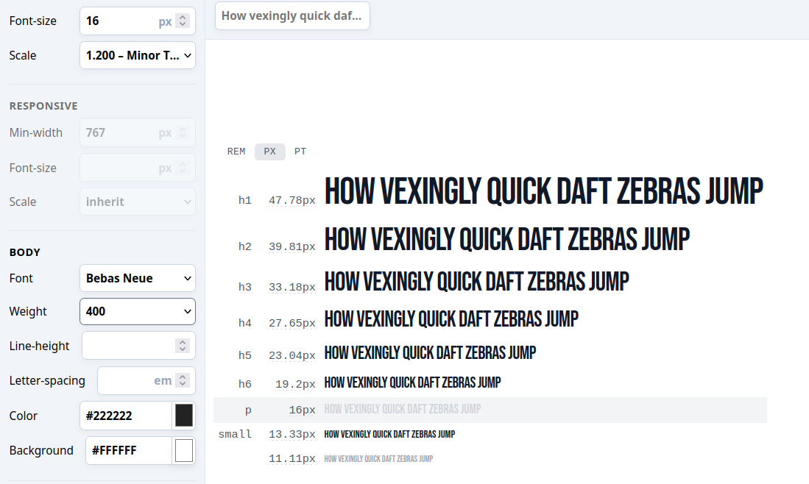
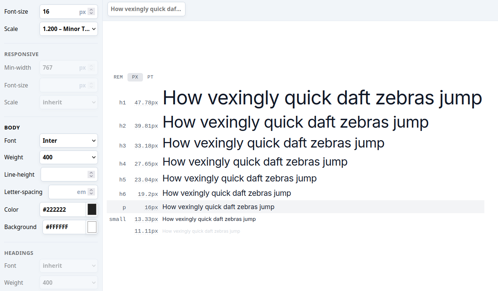

# CHARTE GRAPHIQUE DU SITE : PDC

La charte graphique d’un site web, à pour but de définir toutes les règles visuelles à suivre pour garantir une identité visuelle cohérente sur l’ensemble du site (et parfois même sur tous les supports de communication de la marque).

## LOGO: 

## 🎨 Palette de couleurs du site : PDC 

Le site PDC utlise 4 couleurs  principales pour sa conception (dont 3 provenant du logo), chacune ayant un rôle paticulier dans la création de son identité visuelle e l'expérience utilisateur. La quatrième couleur sera choisit pour sa complémentarité avec la couleur pricipal du logo.

| Couleur             | Rôle                                      | Code hex   |
|---------------------|-------------------------------------------|------------|
| 🟧 Orange Énergie   | Boutons / Appels à l'action / liens       | `#F26A1B`  |
| ⚫ Noir Intense     | Texte principal / Fond sombre             | `#1A1A1A`  |
| 🟨 Beige Clair      | Fond / zones respirantes / confort visuel | `#F6F2ED`  |

### Prposition 4eme couleur : n° 1 

| Couleur             | Rôle                                             | Code hex   |
|---------------------|--------------------------------------------------|------------|
| 🟢 Vert Santé       | Validation / icônes, badges, boutons secondaires | `#6C8C4F`  |

Lien Coolors 👉 [https://coolors.co/f26a1b-1a1a1a-f6f2ed-6c8c4f](https://coolors.co/f26a1b-1a1a1a-f6f2ed-6c8c4f)

### Prposition 4eme couleur : n° 2 

Couleur complémentaire bleue-violacée pour un contraste puissant et moderne.

| Couleur             | Rôle                                             | Code hex   |
|---------------------|--------------------------------------------------|------------|
| 🔵 Blue violet      | Validation / icônes, badges, boutons secondaires | `#6C8C4F`  |

Lien Coolors 👉 [https://coolors.co/f26a1b-1a1a1a-f6f2ed-3b4cca](https://coolors.co/f26a1b-1a1a1a-f6f2ed-3b4cca)

 
### Prposition 4eme couleur : n° 3 

Vert sapin équilibré, bon pour la progression, la santé, le mental.

| Couleur             | Rôle                                             | Code hex   |
|---------------------|--------------------------------------------------|------------|
| 🟢 Office green    | Validation / icônes, badges, boutons secondaires | `#2E7D32`  |

Lien Coolors 👉 [https://coolors.co/f26a1b-1a1a1a-f6f2ed-2e7d32](https://coolors.co/f26a1b-1a1a1a-f6f2ed-2e7d32)

### Prposition 4eme couleur : n° 4

Avec un gris bleuté très clair, pour les sites très aérés.

| Couleur             | Rôle                                             | Code hex   |
|---------------------|--------------------------------------------------|------------|
| 🔵 Bleu Brume    | Validation / icônes, badges, boutons secondaires | `#DDEAF1`  |

Lien Coolors 👉 [https://coolors.co/f26a1b-1a1a1a-f6f2ed-ddeaf1](https://coolors.co/f26a1b-1a1a1a-f6f2ed-ddeaf1)

### Prposition 4eme couleur : n° 5

Une touche de turquoise foncé pour stimuler l'énergie et la fraîcheur.

| Couleur             | Rôle                                             | Code hex   |
|---------------------|--------------------------------------------------|------------|
| 🔵 Turquoise Pro    | Validation / icônes, badges, boutons secondaires | `#007C91`  |

Lien Coolors 👉 [https://coolors.co/f26a1b-1a1a1a-f6f2ed-007c91](https://coolors.co/f26a1b-1a1a1a-f6f2ed-007c91)

### Prposition 4eme couleur : n° 5

Une touche de turquoise foncé pour stimuler l'énergie et la fraîcheur.

| Couleur             | Rôle                                             | Code hex   |
|---------------------|--------------------------------------------------|------------|
| 🔵 Maya Blue    | Validation / icônes, badges, boutons secondaires | `#60BFFF`  |

Lien Coolors 👉 [https://coolors.co/f26a1b-1a1a1a-f6f2ed-007c91](https://coolors.co/f26a1b-1a1a1a-f6f2ed-007c91)

---

## 🔤 Choix Typographiques

## 🔺 Police de Titres 

Des polices avec du caractère, impact, et très lisibles, parfaites pour des titres motivants :
- Utilisée pour : Titres, accroches, boutons  
- Style : Majuscules, impact visuel fort  
- Exemple : `font-title text-4xl uppercase`

    1. **Bebas Neue**

    2. **Anton** – Bold, compact, tout en majuscules

    3. **League Spartan** – Plus large et moderne

    4. **Oswald** – Droit, sérieux, adaptable

## Police de texte standard (pragraphe)

Polices très lisibles et élégantes pour les paragraphes : 
- Utilisée pour : Textes courants, descriptions  
- Style : Moderne, fluide, très lisible  
- Disponible en : 300 (light), 400 (regular), 600 (semibold), 700 (bold)

    1. **Inter** 
    2. **Roboto** – Ultra polyvalente
    3. **Manrope** – Moderne, spacée
    4. **Work Sans** – Plus légère, super lisible

### 🧱 Recommandations Tailwind (base) Ex : Police Bebas Neue et Inter

| Élément          | Police       | Taille (ex.) | Style                |
|------------------|--------------|--------------|----------------------|
| Titre principal  | Bebas Neue   | `text-5xl`   | `uppercase`          |
| Sous-titre       | Bebas Neue   | `text-3xl`   | `uppercase`          |
| Texte standard   | Inter        | `text-base`  | `font-light` à `font-semibold` |
| Boutons CTA      | Bebas Neue   | `text-lg`    | `uppercase font-bold` |

### Type scale police Ex : Police Bebas Neue et Inter

---
